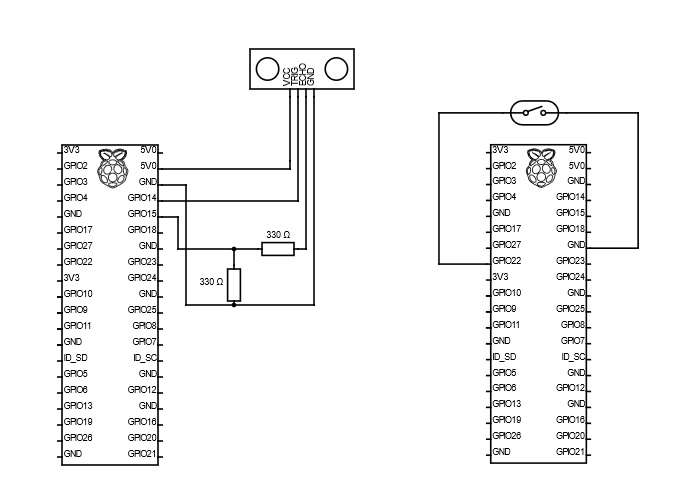

# Dokumentacja Hardware
`## Schemat połączeń

`

## Wykorzystany sprzęt

- **1x przycisk rezystancyjny**
- **1x Czujnik ultradzwiękowy hc-sr04**
- **3x Raspberry Pi Zero W**

## Opis działania

## 1. Podstawa Systemu
- Działanie części hardware oparte jest na protokole **MQTT** oraz połączeniu z **wi-fi**.

## 2. Rola Płytek
- Dwie z płytek pełnią rolę **transmittera**, natomiast jedna z płytek pełni rolę **odbiorcy (receiver)**.

## 3. Podłączenia Transmitterów
- Dwie płytki pełniące rolę transmitterów podłączone są kolejno do:
 - **Przycisku rezystancyjnego**
 - **Czujnika ultradzwiękowego HC-SR04**

## 4. Funkcjonowanie Receivera
- Receiver odbiera dane zebrane przez obie płytki.
- Zmiany są wysyłane w momencie przekroczenia przez układ **threshholdu**, który ustalany jest przez frontend i przesyłany do płytek w momencie jego zmiany.

## 5. Komunikacja w Systemie
- Komunikacja Receiver – Transmitter oparta jest o protokół MQTT.
- Receiver pełni również rolę **brokera MQTT**, natomiast transmitterzy – **klientami MQTT**.

## 6. Automatyczne Uruchamianie Systemu
- System uruchamia się automatycznie wraz z podłączeniem do zasilania.
- Wykorzystano **cron**, będący jednym z podstawowych narzędzi systemów uniksowych, który pozwala na cykliczne uruchamianie programów (w tym przypadku po uruchomieniu systemu).

## 7. Przetwarzanie i Przesyłanie Danych
- Odbierane przez receiver dane są formatowane do formatu **json** oraz przesyłane do serwera.
- Na serwerze tworzony jest nowy wpis w bazie na podstawie odczytanej wartości.

## 8. Rejestracja Czujników
- Czujniki rejestrowane są w bazie czujników od razu po uruchomieniu na podstawie swojego **adresu MAC** (odczytywanego na początku każdego ze skryptów).`
# Przygotowane skrypty

Wykorzystywanymi skryptami są:

- **3 Skrypty pomocnicze w języku bash** – są one wywoływane w Cron’ie – pozwalają one na opóźnienie uruchomienia skryptów pythonowych do momentu gdy MQTT jest gotowe.
- **Skrypt button.py** – Odpowiada za obsługę przycisku oraz przesył danych do brokera MQTT.
- **Skrypt ultrasonic_sensor.py** – Odpowiada za obsługę przycisku oraz przesył danych do brokera MQTT.
- **Skrypt client.py** – jest tak naprawdę sercem systemu, to tutaj odbierane są dane od poszczególnych sensorów oraz przesyłane do serwera.

Każdy ze skryptów pythonowych uruchomiony jest na innej płytce.`