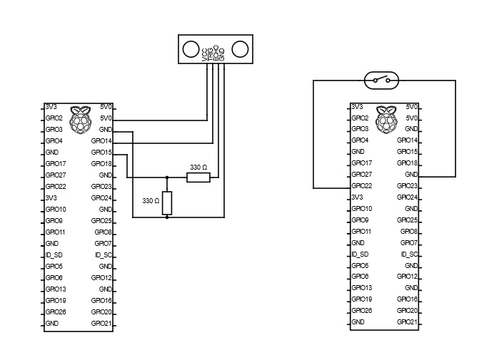

# Restock
# 1\. Podział pracy w projekcie
### Norbert Barczyk
- manager
- REST API
### Amadeusz Gunia
- baza danych
- REST API
- logika aplikacji po stronie backendu (dynamiczna rejestracja sensorów, integracja z Allegro API)
### Hubert Majdański
- hardware (elektronika + skrypty + integracja z serwerem)
### Jakub Sośniak
- hardware (elektronika + skrypty + integracja z serwerem)
### Jan Sopata
- REST API
- integracja backendu z frontendem
### Paweł Bałuszyński
- research Allegro API
- przygotowanie uwierzytelniania z allegro sandbox
### Wiktoria Martyńska
- frontend
- integracja backendu z frontendem
### Marcin Karcz
- baza danych
- uwierzytelnianie
- Docker

# 2\. Model biznesowy - Norbert Barczyk

Model biznesowy zakłada współpracę z serwisem Allegro. Nasz produkt ułatwi użytkownikom korzystanie z zakupów internetowych.
Rozwiązanie to będzie funkcjonować w taki sposób,że dostarczamy Allegro gotowe rozwiązanie, które wymaga uzyskania dostępu do pełnej wersji Allegro.
Allegro następnie może sprzedawać w swoim serwisie nasze rozwiązanie. My dbamy o wsparcie techniczne dla urządzeń i połączenie do Allegro, a Allegro zapewnia dostęp do swojej bazy produktów.

Sposób montażu - Norbert Barczyk

Użytkownik otrzymuje gotowy pojemnik ze zintegrowanym czujnikiem, ponadto dostaje przyciski do rozmieszczenia wedle własnego uznania

 
 
 
# 3\. Dokumentacja Frontendu - Wiktoria Martyńska
### Osoba odpowiedzialna: Wiktoria Martyńska. Wykonana praca znajduje się w katalogu restock-frontend poziom wyżej w repozytorium Git.
## Spis Treści
1. [Wprowadzenie](#wprowadzenie)
1. [Rejestracja i Logowanie](#rejestracja-i-logowanie)
1. [Konfiguracja Czujników](#konfiguracja-czujników)
1. [Edycja Danych Adresowych](#edycja-danych-adresowych)
1. [Zarządzanie Zamówieniami](#zarządzanie-zamówieniami)
1. [Sprawdzanie Szczegółów i Statusów Zamówień](#sprawdzanie-szczegółów-i-statusów-zamówień)
1. [Konfiguracja API Allegro](#konfiguracja-api-allegro)
## 1\. Wprowadzenie
Frontendowa część projektu umożliwia użytkownikom łatwe zarządzanie swoim kontem, czujnikami oraz zamówieniami. Poniżej znajdują się opisy głównych funkcji systemu.
## 2\. Rejestracja i Logowanie
### 2\.1 Rejestracja
Użytkownicy mogą utworzyć nowe konto, podając swoją nazwę użytkownika i hasło.
### 2\.2 Logowanie
Zarejestrowani użytkownicy mogą zalogować się na wcześniej utworzone konto. Sesje są bezpieczne, a użytkownicy mają dostęp do swojego konta po zalogowaniu. W systemie generowany jest indywidualny token dla każdego użytkownika.
## 3\. Konfiguracja Czujników
### 3\.1 Dodawanie Czujników
Zalogowani użytkownicy mogą skonfigurować nowo podłączone czujniki. W trakcie procesu konfiguracji, użytkownicy podają niezbędne informacje o nowym czujniku, takie jak nazwa, obsługiwany przez niego produkt itp.
### 3\.2 Edycja Czujników
Użytkownicy mają możliwość edycji parametrów swoich dodanych czujników. Mogą aktualizować nazwę, przypisywać produkt do danego czujnika, modyfikować progi decyzyjne odnośnie rozpoczęcia procesu zamówienia danego produktu. Opcjonalnie, mogą także wybrać preferowaną markę i ilość produktu.
## 4\. Edycja Danych Adresowych
Zalogowani użytkownicy mogą edytować swoje dane adresowe, takie jak adres zamieszkania, numer telefonu itp. Aktualizacje te wpływają na informacje używane w procesie zamawiania.
## 5\. Zarządzanie Zamówieniami
### 5\.1 Przegląd Zamówień
Użytkownicy mają dostęp do listy swoich zamówień. Mogą przeglądać je chronologicznie i sprawdzać ich ogólne informacje.
### 5\.2 Akceptacja/Odrzucenie Zamówienia
Użytkownicy mogą akceptować lub odrzucać otrzymane zamówienia. Proces ten jest intuicyjny i zapewnia szybką reakcję na nowe zamówienia.
## 6\. Sprawdzanie Szczegółów i Statusów Zamówień
### 6\.1 Szczegóły Zamówienia
Po wybraniu konkretnego zamówienia, użytkownicy mogą zobaczyć jego szczegóły, takie jak produkty, ilość, cena itp.
### 6\.2 Statusy Zamówień
Użytkownicy mają możliwość sprawdzania bieżącego statusu swoich zamówień. Statusy są aktualizowane na bieżąco, aby dostarczyć informacje na temat przetwarzania zamówienia.
## 7\. Konfiguracja API Allegro
Użytkownicy mogą także skonfigurować parametry API Allegro używanego do składania zamówień. Mogą wybrać, czy korzystają z Allegro Smart!, czy chcą kupować tylko od Super Sprzedawców oraz ze Strefy Marek. Mogą także zdecydować, czy paczki mają być wysyłane kurierem czy do paczkomatu.

# 4\. Dokumentacja Hardware - Hubert Majdański, Jakub Sośniak
## Schemat połączeń
`
## Wykorzystany sprzęt
- **1x przycisk rezystancyjny**
- **1x Czujnik ultradzwiękowy hc-sr04**
- **3x Raspberry Pi Zero W**
## Opis działania
## 1\. Podstawa Systemu
- Działanie części hardware oparte jest na protokole **MQTT** oraz połączeniu z **wi-fi**.
## 2\. Rola Płytek
- Dwie z płytek pełnią rolę **transmittera**, natomiast jedna z płytek pełni rolę **odbiorcy (receiver)**.
## 3\. Podłączenia Transmitterów
- Dwie płytki pełniące rolę transmitterów podłączone są kolejno do:
- **Przycisku rezystancyjnego**
- **Czujnika ultradzwiękowego HC-SR04**
## 4\. Funkcjonowanie Receivera
- Receiver odbiera dane zebrane przez obie płytki.
- Zmiany są wysyłane w momencie przekroczenia przez układ **threshholdu**, który ustalany jest przez frontend i przesyłany do płytek w momencie jego zmiany.
## 5\. Komunikacja w Systemie
- Komunikacja Receiver – Transmitter oparta jest o protokół MQTT.
- Receiver pełni również rolę **brokera MQTT**, natomiast transmitterzy – **klientami MQTT**.
## 6\. Automatyczne Uruchamianie Systemu
- System uruchamia się automatycznie wraz z podłączeniem do zasilania.
- Wykorzystano **cron**, będący jednym z podstawowych narzędzi systemów uniksowych, który pozwala na cykliczne uruchamianie programów (w tym przypadku po uruchomieniu systemu).
## 7\. Przetwarzanie i Przesyłanie Danych
- Odbierane przez receiver dane są formatowane do formatu **json** oraz przesyłane do serwera.
- Na serwerze tworzony jest nowy wpis w bazie na podstawie odczytanej wartości.
## 8\. Rejestracja Czujników
- Czujniki rejestrowane są w bazie czujników od razu po uruchomieniu na podstawie swojego **adresu MAC** (odczytywanego na początku każdego ze skryptów).`
# Przygotowane skrypty
Wykorzystywanymi skryptami są:

- **Trzy skrypty pomocnicze w języku bash** – są one wywoływane w Cron’ie – pozwalają one na opóźnienie uruchomienia skryptów pythonowych do momentu gdy MQTT jest gotowe. - Hubert
- **Skrypt button.py** – Odpowiada za obsługę przycisku oraz przesył danych do brokera MQTT. - Hubert
- **Skrypt ultrasonic\_sensor.py** – Odpowiada za obsługę przycisku oraz przesył danych do brokera MQTT. - Jakub
- **Skrypt client.py** – jest tak naprawdę sercem systemu, to tutaj odbierane są dane od poszczególnych sensorów oraz przesyłane do serwera. - Jakub

Każdy ze skryptów pythonowych uruchomiony jest na innej płytce.`

# 5\. Dokumentacja bezpieczeństwa - Marcin Karcz
## 5\.1 Zabezpieczenie API przed nieautoryzowanym dostępem
### 5\.1.1 API użytkownika
Wszystkie punkty końcowe udostępnione użytkownikowi zostały zabezpieczone z wykorzystaniem tokenów JWT (JSON Web Token).
Aby request wykonany przez użytkownika mógł zostać uznany za poprawny, wymagane jest, aby w nagłówku HTTP "Authorization"
znajdował się następujący ciąg znaków:
"Bearer JWT", gdzie JWT jest tokenem generowanym przez aplikację po udanej operacji logowania. Dla każdego request'u wykonanego na
API użytkownika, wykonywana jest walidacja tokenu JWT. Sprawdzane jest:

- czy token może zostać zdekodowany na podstawie sekretnego hasła JWT
- potencjalne przedawnienie tokena

Sekretne hasło JWT (JWT\_SECRET) jest globalnym parametrem, konfigurowanym w pliku application.properties (głównej konfiguracji usługi backend).
### 5\.1.2 API Sensorów
Wszystkie punkty końcowe udostępnione do komunikacji z sensorami zostały zabezpieczone na podstawie generowanych przez aplikacje tokenów (losowych ciągów znaków).
W tym przypadku nie mamy do czynienia do przenoszenia żadnych metadanych zakodowanych w tokenie, dlatego zrezygnowano z niepotrzebnej komplikacji wprowadzanej przez JWT.

Aby request wykonany przez sensor mógł zostać uznany za poprawny, wymagane jest, aby w nagłówku HTTP "Authorization"
znajdował się następujący ciąg znaków:
"Sensor SENSOR\_TOKEN", gdzie SENSOR\_TOKEN jest wcześniej wspomnianym tokenem, generowanym przez aplikację po udanej operacji rejestrowania sensora. Dla każdego request'u wykonanego na
API użytkownika, wykonywana jest walidacja SENSOR\_TOKEN. Sprawdzana jest poprawność przesyłanego tokenu, z wartością wyciągniętą z bazy danych.

SENSOR\_TOKEN jest generowany jeden raz i przypisywany do danego sensora. Każdy nowy sensor musi zarejestrować się w aplikacji, aby uzyskać swój unikalny token.
API rejestracyjne sensorów jest zabezpieczone i wymaga nagłówku HTTP "Authorization", który zawiera ciąg znaków "Register SENSOR\_REGISTER\_TOKEN",
gdzie SENSOR\_REGISTER\_TOKEN jest parametrem globalnym aplikacji, konfigurowanym w pliku application.properties (głównej konfiguracji usługi backend).
Rejestracja sensora jest poprawna tylko i wyłącznie, kiedy zawartość nagłówka Authorization zgadza się z parametrem globalnym SENSOR\_REGISTER\_TOKEN.
### 5\.1.3 API do rejestracji oraz logowania użytkowników
Punkty końcowe udostępniające możliwość rejestracji oraz logowania użytkownika nie wymagają dodatkowego uwierzytelnienia.
## 5\.2 Bezpieczeństwo połączenia z bazą danych
Połączenie z bazą danych zostało zabezpieczone za pośrednictwem protokołu TLSv1.3. W tym celu, z wykorzystaniem narzędzi openSSL zostały wygenerowane własnoręcznie podpisane certyfikaty.

# 6\. Dokumentacja Allegro - Paweł Bałuszyński [link do drugiego repo](https://github.com/baluszynski/allegro-connection)
## [Uwierzytelnianie Client_credentials](https://developer.allegro.pl/tutorials/uwierzytelnianie-i-autoryzacja-zlq9e75GdIR#clientcredentials-flow)
Korzystając z konta Allegro należy przejść pod [link](https://apps.developer.allegro.pl.allegrosandbox.pl/) i zarejestrować nową aplikację, wykorzystującą uwierzytelnianie typu device, aby otrzymać unikalne *CLIENT ID* i *CLIENT SECRET*. Umożliwia to autoryzację aplikacji bez zgodny użytkownika na działanie. Dzięki temu zapewniony jest dostęp do publicznych zasobów Allegro jak oferty (w wersji sandbox) zgodnie z [regulaminem REST API](https://allegro.pl/dla-sprzedajacych/1-czerwca-2021-w-api-allegro-ograniczymy-dostep-do-publicznych-danych-o-sprzedazy-innych-uzytkownikow-i-zmienimy-forme-ich-udostepniania-O3BlgZVdwCa).
## Autoryzacja aplikacji
Aby się zautoryzować należy wykonać żądanie HTTP metodą POST na adres: https://allegro.pl.allegrosandbox.pl/auth/oauth/token, przesyłając w nagłówku CLIENT ID i CLIENT SECRET w formacie base64, oraz ustawić typ dostępu "grant\_type=client\_credentials".

W odpowiedzi przesyłany jest JSON zawierający token dostępowy, który jest wykorzystywany podczas listowania ofert (możliwe jest również odpytywanie innych ogólnie dostępnych zasobów Allegro Sandbox).
## Pobieranie list produktów z Allegro Sandbox
Pobierania list ofert z Allegro możliwe jest z wykorzystaniem endpointu: https://api.allegro.pl.allegrosandbox.pl/offers/listing, gdzie istnieje możliwość filtrowania wyników poprzez ustawienie różnych parametrów:

- **Parametr option** - pozwala na filtrowanie ofert według różnych opcji:
  - Oferty z opcją Allegro Smart!: "SMART"
  - Oferty od Super Sprzedawców: "SUPERSELLER"
  - Oferty ze Strefy marek: "BRAND\_ZONE"
- **Parametr deliveryMethod** - umożliwia filtrowanie ofert według metody dostawy:
  - Dostawa do Paczkomatu: "5b445fe6580ce26bb2f9960a"
  - Dostawa kurierem: "5b445fa0580ce26bb2f99602"
- **Parametr sort** - służy do sortowania ofert:
  - Sortowanie po cenie rosnąco: "+price"
  - Sortowanie po cenie wraz z kosztem dostawy rosnąco: "+withDeliveryPrice"
## Algorytm wyszukiwania najlepszej oferty - Amadeusz Gunia
1. Pobieranie produktów z podstawowymi filtrami:
   - nazwa (wymagane)
   - preferowana marka
   - preferowana ilość
1. W pierwszym kroku są wyszukiwane oferty z dodatkowymi filtrami, a następnie dodawane do listy
1. Jeśli lista jest niepusta to zwracana jest oferta o najniższej cenie, w przeciwnym wypadku wyszukiwane są produkty bez filtrów
1. Do listy dodawane są oferty bez dodatkowych filtrów i jeśli lista jest niepusta to następuje filtrowanie wewnętrzne:
   1. Sprawdzenie czy oferty wystawiane są przez Super sprzedawców, jeśli niepuste to:
   1. Sprawdzenie ofert preferowanej marki, jeśli niepuste to:
   1. Sprawdzenie preferowanej ilości
   1. Zwrócenie najlepszej oferty (może nastąpić również w momencie gdy któryś etap filtrowania odrzuci wszystkie oferty)
1. Jeśli żadne produkty nie pasują do wyszukiwania zwracana jest pusta lista (brak zamówienia)

Domyślne opcje tworzenia zapytania zawierają:

- format sprzedaży "Kup teraz"
- tylko nowe produkty (stan: Nowy)

# 7\. Dokumentacja Backend - Marcin Karcz, Amadeusz Gunia, Jan Sopata, Norbert Barczyk
# 7\. API - Marcin Karcz
RESTowe API wystawione po stronie backendu umożliwia użytkownikowi wykonanie wielu czynności związanych z podstawowymi operacjami na danych. tzw. CRUD (create, read, update, delete).
## 7\.1 Adresy - Jan Sopata
GET /api/address
Parametry: id (Long) - Identyfikator adresu.
Pobiera informacje o konkretnym adresie na podstawie jego identyfikatora.

PUT /api/address
Ciało żądania: Obiekt typu AddressDTO reprezentujący zaktualizowane dane adresu.
Aktualizuje dane istniejącego adresu na podstawie dostarczonych informacji.
## 7\.2 Dane z sensorów - Norbert Barczyk,Amadeusz Gunia
POST /api/data
Ciało żądania: Obiekt typu DataDTO reprezentujący dane z sensorów.
Dodaje nowe dane do systemu na podstawie dostarczonych informacji. Zostaje to wykonane po stronie hardware'u w momencie przekroczenia odpowiedniego thresholdu.
Ten punkt końcowy jest odpowiedzalny także za wywołanie logiki odpowiedzialnej za wyszukanie najlepszej oferty po stronie Allegro API.
## 7\.3 Zamówienia - Amadeusz Gunia,Jan Sopata
GET /api/orders/pending
Pobiera listę zamówień, które oczekują na realizację (czyli te o statusie ACCEPTED, IN\_DELIVERY i PENDING).

GET /api/orders/history
Pobiera historię zamówień (czyli listę zamówień o statusie COMPLETED i REJECTED).

PUT /api/orders/accept
Parametry: id (Long) - Identyfikator zamówienia do zaakceptowania.
Zmienia status zamówienia na "ACCEPTED" na podstawie jego identyfikatora.

PUT /api/orders/reject
Parametry: id (Long) - Identyfikator zamówienia do odrzucenia.
Zmienia status zamówienia na "REJECTED" na podstawie jego identyfikatora.
## 7\.4 Parametry - Marcin Karcz,Jan Sopata
GET /api/parameters/all
Pozwala na pobranie parametrów(wyboru ofert Allegro i sposobu dostawy): Allegro Smart!, Super Sprzedawca, Strefa Marek, Paczkomat/Kurier.
Są one niezbędne przy szukaniu najlepszej oferty z platformy Allegro.

PUT /api/parameters
Ciało żądania: Lista obiektów typu ParameterDTO reprezentujących zaktualizowane dane parametrów.
Aktualizuje dane wszystkich parametrów na podstawie dostarczonych informacji.
## 7\.5 Sensory - Norbert Barczyk, Jan Sopata
GET /api/sensors/all
Pobiera wszystkie sensory z systemu.

GET /api/sensors
Parametry: id (Long) - Identyfikator sensora.
Pobiera informacje o konkretnym sensorze na podstawie jego identyfikatora.

POST /api/sensors/register
Ciało żądania: Obiekt typu NewSensorRequest reprezentujący dane nowego sensora.
Dynamicznie rejestruje nowy sensor w systemie na podstawie dostarczonych danych z hardware'u.
Dodatkowo dodaje 2 thresholdy powiązane z danym sensorem: Threshold for Update i Threshold for Order (w przypadku gdy sensor to fizyczny przycisk [PHYSICAL\_BUTTON] a nie czujnik odległości [DISTANCE\_SENSOR] to thresholdy ustawiane są na wartości 1).

PUT /api/sensors
Ciało żądania: Obiekt typu SensorDTO reprezentujący zaktualizowane dane sensora.
Aktualizuje dane istniejącego sensora na podstawie dostarczonych informacji.

DELETE /api/sensors
Parametry: id (Long) - Identyfikator sensora do usunięcia.
Usuwa sensor z systemu na podstawie jego identyfikatora.

# 8\. Dokumentacja bazy danych - Amadeusz Gunia
## MariaDB
Do stworzenia i utrzymania bazy danych w naszym projekcie został wybrany system **MariaDB**. Jest to darmowa relacyjna baza danych wywowdząca się z MySQL.
## Struktura bazy danych
Poniżej przedstawiono wszystkie tabele i dodatkowe/pozostałe elementy bazodanowe używane w projekcie. Cała struktura bazy jest tworzona za pomocą skryptów SQL podczas budowania aplikacji z użyciem Docker'a. Nazwa bazy danych to **restock\_db**.
### Tabele
#### users
Tabela *users* służy do przechowywania danych użytkowników zarejestrowanych w aplikacji. Zawiera kolumny z podstawowymi danymi użytkownika oraz kolumny do celów audytowych i archiwalnych (daty utworzenia, modyfikacji i usunięcia).

|Nazwa kolumny|Typ kolumny|Opis|
| :-: | :-: | :-: |
|id|INT|Identyfikator użytkownika|
|username|VARCHAR(30)|Nazwa (login) użytkownika|
|password|TEXT|Hash hasła użytkownika|
|create\_date|TIMESTAMP|Data utworzenia użytkownika|
|modify\_date|TIMESTAMP|Data modyfikacji użytkownika|
|remove\_date|TIMESTAMP|Data usunięcia użytkownika|

#### sensors
Tabela *sensors* służy do przechowywania danych sensorów używanych w systemie. Zawiera kolumny z różnymi danymi sensora, zarówno widocznymi dla użytkownika jak również technicznymi oraz kolumny do celów audytowych i archiwalnych (daty utworzenia, modyfikacji i usunięcia).

|Nazwa kolumny|Typ kolumny|Opis|
| :-: | :-: | :-: |
|id|INT|Identyfikator sensora|
|mac\_address|TEXT|Adres MAC karty sieciowej sensora|
|type|VARCHAR(1)|Typ sensora (czujnik odległości lub przycisk)|
|name|TEXT|Nazwa sensora|
|product|TEXT|Nazwa produktu przypisanego do sensora|
|preferred\_brand|TEXT|Preferowana marka produktu|
|preferred\_amount|TEXT|Preferowana ilość produktu|
|sensor\_token|VARCHAR(30)|Token używany podczas przesyłania danych przez sensor|
|create\_date|TIMESTAMP|Data utworzenia sensora|
|modify\_date|TIMESTAMP|Data modyfikacji sensora|
|remove\_date|TIMESTAMP|Data usunięcia sensora|

#### thresholds
Tabela *thresholds* służy do przechowywania wartości (progów), dla których podejmowane są akcje wykonywane przez sensory. Dla każdego sensora tworzone są dwa wpisy (**U**PDATE oraz **O**RDER) Zawiera kolumny z danymi oraz kolumny do celów audytowych i archiwalnych (daty utworzenia, modyfikacji i usunięcia).

|Nazwa kolumny|Typ kolumny|Opis|
| :-: | :-: | :-: |
|id|INT|Identyfikator progu|
|sensor\_id|INT|Identyfikator sensora (id z tabeli *sensors*)|
|type|VARCHAR(1)|Typ progu (dot. aktualizacji danych lub składania zamówień)|
|value|DOUBLE|Wartość progu|
|create\_date|TIMESTAMP|Data utworzenia progu|
|modify\_date|TIMESTAMP|Data modyfikacji progu|
|remove\_date|TIMESTAMP|Data usunięcia progu|

#### sensor\_data
Tabela *sensor\_data* służy do przechowywania danych przesyłanych przez sensory. Zawiera kolumny z danymi oraz kolumnę do celów audytowych i archiwalnych (data utworzenia).

|Nazwa kolumny|Typ kolumny|Opis|
| :-: | :-: | :-: |
|id|INT|Identyfikator wpisu|
|sensor\_id|INT|Identyfikator sensora (id z tabeli *sensors*)|
|value|DOUBLE|Odczytana wartość|
|create\_date|TIMESTAMP|Data utworzenia wpisu|

#### orders
Tabela *orders* służy do przechowywania zamówień złożonych przez Allegro API. Zawiera kolumny z danymi oraz kolumny do celów audytowych i archiwalnych (daty utworzenia i modyfikacji).

|Nazwa kolumny|Typ kolumny|Opis|
| :-: | :-: | :-: |
|id|INT|Identyfikator zamówienia|
|status|VARCHAR(1)|Status zamówienia|
|offer\_id|TEXT|ID oferty z Allegro|
|name|TEXT|Nazwa produktu/oferty|
|photo\_url|TEXT|URL ze zdjęciem oferty|
|product\_price|DOUBLE|Cena produktu|
|delivery\_price|DOUBLE|Cena dostawy|
|smart|VARCHAR(1)|Flaga określająca czy oferta jest SMART|
|create\_date|TIMESTAMP|Data utworzenia zamówienia|
|modify\_date|TIMESTAMP|Data modyfikacji statusu zamówienia|
|user\_id|INT|Identyfikator użytkownika, który zmienił status|

#### parameters
Tabela *parameters* służy do przechowywania parametrów używanych przez Allegro API. Zawiera kolumny z danymi oraz kolumny do celów audytowych i archiwalnych (daty utworzenia i modyfikacji).

|Nazwa kolumny|Typ kolumny|Opis|
| :-: | :-: | :-: |
|id|INT|Identyfikator parametru|
|type|VARCHAR(1)|Typ parametru|
|value|VARCHAR(1)|Wartość parametru|
|create\_date|TIMESTAMP|Data utworzenia parametri|
|modify\_date|TIMESTAMP|Data modyfikacji wartości parametru|

#### addresses
Tabela *addresses* służy do przechowywania adresu, na który zamawiane będą produkty z Allegro API. Tabela ta zawiera maksymalnie jeden wiersz składający się z kolumn z danymi oraz kolumn do celów audytowych i archiwalnych (daty utworzenia i modyfikacji).

|Nazwa kolumny|Typ kolumny|Opis|
| :-: | :-: | :-: |
|id|INT|Identyfikator adresu|
|first\_name|TEXT|Imię|
|last\_name|TEXT|Nazwisko|
|street|TEXT|Ulica|
|house\_number|TEXT|Numer domu (mieszkania)|
|postal\_code|VARCHAR(6)|Kod pocztowy|
|city|TEXT|Miejscowość|
|phone\_number|VARCHAR(9)|Numer telefonu|
|email|TEXT|Adres email|
|create\_date|TIMESTAMP|Data utworzenia adresu|
|modify\_date|TIMESTAMP|Data modyfikacji adresu|

### Ograniczenia (ang. constraints)
W bazie danych dodano dodatkowe ograniczenia dla wybranych tabel tj. sprawdzanie unikalności rekordów na podstawie wybranej kolumny lub par kolum, a także sprawdzanie wartości kolumn na podstawie zdefiniowanych zbiorów możliwych wartości (ang. enumeration).

|Nazwa tabeli|Typ ograniczenia|Zakres/warunki ograniczenia|
| :-: | :-: | :-: |
|users|UNIQUE|username|
|sensors|UNIQUE|sensor\_token|
|thresholds|UNIQUE|sensor\_id, type|
|parameters|UNIQUE|type|
|orders|CHECK|status IN ('P', 'A', 'R', 'D', 'C')|
|sensors|CHECK|type IN ('D', 'B')|
|thresholds|CHECK|type IN ('U', 'O')|
|parameters|CHECK|type IN ('S', 'B', 'Z', 'F')|

### Skrypty
Do stworzenia bazy danych używane są trzy skrypty SQL. Pierwszy z nich tworzy opisane powyżej tabele, drugi dodaje ograniczenia, a trzeci wprowadza do tabeli parameters odpowiednie parametry z domyślnymi wartościami.

# 9\. Dokumentacja wdrożenia systemu - Marcin Karcz
## Wstęp
W celu ułatwienia deploymentu całości aplikacji frontend, backend oraz baza danych zostały skonterenyzowane. Aby, skutecznie
wystartować wspomniane serwisy, należy zadbać o to, aby docker na maszynie hosta korzystał z docker engine w wersji 19.03.0+.
W katalogach z kodem źródłowym frontendu oraz backendu zostały przygotowane pliki Dockerfile, odpowiedzialne za tworzenie obrazów dla wspomnianych usług.
## Docker compose
Definicja oraz konfiguracja kontenerów została zawarta w pliku docker-compose.yml. Z uwagi, że występuje silna zależność pomiędzy serwisami tj.
database -> backend -> frontend, został zaimplementowany mechanizm, który wymusza na kontenerze z daną usługą, poczekanie aż kontener z usługą, od której jest zależny, z sukcesem wystartuje.

1. Baza danych - z okazji, że proces inicjalizacji bazy danych odbywa się po wystartowaniu kontenera (skrypty zawierające strukturę startują wtedy, kiedy proces mariadb w kontenerze
   jest w pełni funkcjonalny), okresowo co 5 sekund wywoływana jest komenda SHOW TABLES FROM restock\_db. Jeśli komenda w końcu zostanie wykonana z sukcesem, docker uznaje, że kontener bazy danych jest w stanie "healthy"
1. Backend - kontener po stworzeniu struktury serwisów pozostaje w stanie "created", dopóki baza danych nie jest w stanie "healthy" -> jeśli jest, to kontener zaczyna się w pełni uruchamiać i przechodzi do stanu "started"
1. Frontend - czeka z pełnym uruchomieniem, aż do przejścia konteneru z backendem w stan "started"
